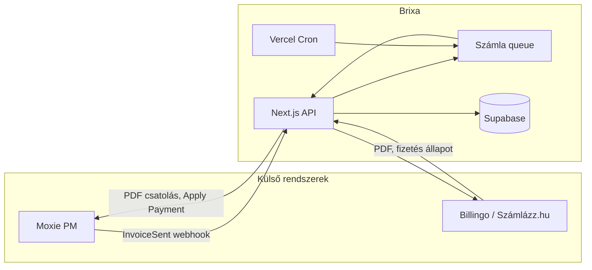

# Brixa

> **Automatikus számlakészítő híd a Moxie és a magyar számlázóprogramok között.**

*A repository neve: MoxieInvoice.*

---

## Az alkalmazásról

A **Brixa** egy előfizetéses SaaS alkalmazás, amely összeköti a [Moxie](https://withmoxie.com) projektmenedzsment platformot a **Billingo** és a **Számlázz.hu** számlázórendszerekkel.

**A probléma:** A Moxie kiválóan kezeli az ügyfeleket és a projekteket, de nincs közvetlen integráció a magyar számviteli rendszerekkel. A számlákat külön kellene másolni, feltölteni, és a fizetési állapotot kézzel szinkronizálni.

**A megoldás:** Amikor a Moxie-ban egy számlát „Elküldve” állapotba állítasz, a Brixa automatikusan elkészíti a hivatalos számlát a kiválasztott számlázóprogramban, csatolja a PDF-et vissza Moxie-hoz, majd fizetés esetén szinkronizálja a fizetési állapotot is. A teljes folyamat emberi beavatkozás nélkül zajlik: Moxie-ban rögzíted az üzleti adatokat, a számlát pedig a törvénynek megfelelő hazai számlázóprogram állítja ki.

---

## Célközönség

A Brixa azoknak a **magyar vállalkozóknak és ügynökségeknek** szól, akik:

- A **Moxie**-t használják projekt- és ügyfélkezelésre,
- **Billingot** vagy **Számlázz.hu**-t használnak hivatalos számlakiállításra,
- Szeretnék automatizálni a számlakiállítást és a fizetés visszaigazolását a két rendszer között.

---

## Architektúra

A Brixa központi szerepet tölt be: a Moxie webhookja és a számlázó szolgáltatások között hídként működik. Az alkalmazás Next.js API-n, üzenetsoron (queue) és Vercel Cron jobokon fut; az auth és az adat Supabase-ben, az előfizetés Stripe-ban van kezelve.



---

## Fő adatfolyamok

### Automatikus számla (Moxie → Brixa → számlázó → Moxie)

1. A Moxie-ban egy számlát „Elküldve” (Sent) állapotba állítasz.
2. A Moxie **InvoiceSent** webhookot küld a Brixa API-nak (org + secret paraméterekkel).
3. A Brixa validálja a kérést, ellenőrzi az előfizetést; opcionálisan ütemezés szerint (munkanap / munkaidő) a sorba teszi a feladatot.
4. A queue feldolgozása (cron vagy azonnal) meghívja a Billingo vagy Számlázz.hu API-t, és létrehozza a hivatalos számlát.
5. A kapott PDF URL-t a Brixa visszaküldi a Moxie-nak (`attachFileFromUrl`), így a számla a Moxie-ban is megjelenik.
6. Fizetés esetén a Brixa (Billingo webhook vagy napi sync cron) szinkronizálja a fizetési állapotot, és Moxie-ban **Apply Payment** értesítést küld.

### Manuális számla

A Brixa Beállításokból vagy a menüből elérhető „Új számla” űrlap ugyanazt az orchestrator logikát használja: a megadott adatokból a választott számlázóban létrehozza a számlát, és (ha Moxie adatok is vannak) csatolja a PDF-et.

### Fizetés szinkronizáció

- **Billingo webhook:** Fizetési esemény érkezik a Brixa webhook endpointjára → a Brixa frissíti a belső állapotot és Moxie-ban Apply Payment-ot küld.
- **Cron (sync-billingo-payments):** Naponta egyszer a Brixa lekéri a Billingo/Számlázz.hu fizetési állapotokat, és a fizetett számlákhoz Moxie Apply Payment-ot triggerel.

---

## Funkciók

### Számlázás

- **Automatikus számlakiállítás** Moxie webhook alapján (`InvoiceSent` esemény)
- **Manuális számla** létrehozása webes űrlapon keresztül
- **Billingo v3** és **Számlázz.hu** (Számla Agent XML API) támogatás
- PDF csatolása vissza Moxie-hoz (`attachFileFromUrl`)
- Sikertelen számlák mentése hibaüzenettel, piros státusszal

### Fizetési szinkronizáció

- Billingo / Számlázz.hu fizetési állapot lekérése (Frissítés gomb + cron)
- Fizetett számla esetén Moxie `Apply Payment` értesítés
- Billingo webhook fogadása fizetési eseményekhez

### Beállítások

- **Moxie kapcsolat:** API kulcs, webhook URL generálása + másolása, kapcsolat teszt
- **Számlázóprogram:** Billingo vagy Számlázz.hu kiválasztása, titkosított hitelesítő adatok
- **Számla alapértékek:** alapértelmezett számlatömb (Billingo), nyelv, fizetési mód
- **Eladó adatok:** cég neve, adószám, cím – ezek kerülnek a számlákra
- **EUR / USD → HUF árfolyam:** fix árfolyam vagy napi MNB középárfolyam (MNB API), opcionálisan manuális EUR/USD
- **Mező megfeleltetés:** Moxie custom field → számlázó mező (pl. számlatípus, áfakulcs), értékmapping
- **Ütemezés:** számlázás csak munkanapokon / munkaidőben (timezone, start/end time), queue + Vercel Cron
- **Billingo e-mail küldés:** számla automatikus elküldése emailben a vevőnek

### Dashboard

- Kinnlévő összeg (ki nem fizetett nyitott számlák), devizanként
- Bevétel az elmúlt 30 napban
- Sikertelen számlák száma / sikeresség
- Legutóbbi 5 számla gyors áttekintése
- 3 lépéses onboarding vezető (előfizetés → Moxie → számlázó)

### Számlalista

- Állapot szerint szűrhető lista (Létrehozva / Moxie-ba szinkronizálva / Sikertelen)
- Vevő neve, számlaszám, összeg, fizetési állapot
- Külső link: számla megnyitása Billingo / Számlázz.hu felületén
- Moxie ikon gomb: számla megnyitása közvetlenül Moxie-ban
- Törölhető bármelyik számla – inline pill megerősítéssel (popup nélkül)
- Hibaüzenet kibontható részletes nézettel

### Előfizetés és auth

- **Magic Link** alapú bejelentkezés (jelszó nélkül), Supabase PKCE
- **Stripe** előfizetés: Checkout, Customer Portal, webhook kezelés
- Aktív/próba előfizetés ellenőrzése minden webhook kérésnél
- Titkosított API kulcsok tárolása (AES-256-GCM)

### Egyéb

- **HU/EN kétnyelvűség** (next-intl, alapértelmezett: magyar)
- Rate limiting webhookhoz (60 req/perc/kliens)
- Vercel Cron: számlasor feldolgozása + fizetési szinkron
- Vitest egységtesztek

---

## Tech stack

| Réteg    | Technológia |
|----------|-------------|
| Frontend | Next.js 16 (App Router, Turbopack), React 19, TypeScript 5.6 |
| Stílus   | Tailwind CSS 3.4, egyedi design rendszer |
| Auth + DB| Supabase (Magic Link PKCE, PostgreSQL, RLS) |
| Fizetés  | Stripe (Checkout, Customer Portal, webhooks) |
| i18n     | next-intl 4.8 (hu alapértelmezett, en) |
| Tesztelés| Vitest |
| Deploy   | Vercel (App + Cron Jobs) |

---

## Projektstruktúra (rövid áttekintés)

| Útvonal / mappa | Jelentése |
|------------------|-----------|
| `src/app` | Next.js App Router: `[locale]/(auth)` (login/signup), `(app)` (dashboard, számlák, beállítások), `(wizard)` (onboarding) |
| `src/app/api` | API útvonalak: `webhooks/moxie`, `webhooks/billingo`, `cron/process-invoice-queue`, `cron/sync-billingo-payments`, `stripe/*`, `invoices/*`, `settings/*` |
| `src/lib` | Üzleti logika: `invoices` (orchestrator, billingo, szamlazz, validáció, árfolyam), `moxie`, `crypto`, `rate-limit`, `supabase` |
| `src/components` | UI: dashboard, számlalista, beállítások tabok, onboarding wizard, közös komponensek |
| `supabase/migrations` | PostgreSQL migrációk (táblák, RLS, policy-k) |

---

## Telepítés és beállítás

### 1. Függőségek

```bash
npm install
```

### 2. Környezeti változók

Másold `.env.example` → `.env.local` és töltsd ki:

| Változó | Hol találod | Megjegyzés |
|---------|-------------|------------|
| `NEXT_PUBLIC_SUPABASE_URL` | Supabase → Project Settings → API → Project URL | |
| `NEXT_PUBLIC_SUPABASE_PUBLISHABLE_KEY` | Ugyanott → Publishable key | Kliens oldali auth |
| `SUPABASE_SECRET_KEY` | Ugyanott → Secret key | Szerver oldali műveletek |
| `NEXT_PUBLIC_APP_URL` | Saját app URL | Dev: `http://localhost:3000` |
| `STRIPE_SECRET_KEY` | Stripe Dashboard → API keys | |
| `STRIPE_WEBHOOK_SECRET` | Stripe → Webhooks → Signing secret | |
| `STRIPE_PRICE_ID_MONTHLY` | Stripe → Products → havi ár ID | Havi előfizetés price ID |
| `STRIPE_PRICE_ID_YEARLY` | Stripe → Products → éves ár ID | Éves előfizetés price ID (pl. 2 hónap ingyen) |
| `ENCRYPTION_KEY` | Generált 64 jegyű hex | API kulcsok titkosításához¹ |
| `CRON_SECRET` | Saját titkos string | Vercel Cron auth (opcionális) |

> ¹ Generálás: `node -e "console.log(require('crypto').randomBytes(32).toString('hex'))"`

### 3. Supabase – adatbázis migrációk

Futtasd a migrációkat sorrendben (Supabase CLI: `supabase db push`, vagy Supabase SQL Editor-ban egyenként):

```
supabase/migrations/
├── 20250101000001_initial_schema.sql                    – táblák, RLS, policy-k
├── 20250102000001_rls_and_search_path_fix.sql           – RLS finomítás
├── 20250103000001_create_org_for_user.sql               – org létrehozása regisztrációkor
├── 20250310000001_moxie_last_tested_at.sql              – Moxie kapcsolat tesztelési ideje
├── 20260310000001_stripe_idempotency_and_job_retries.sql – Stripe idempotencia + job retry
├── 20260310000002_schedule_type_all_days_hours.sql      – Ütemezés típusa (all_days, hours)
├── 20260310000003_invoices_total_amount.sql            – Számla összeg mező
├── 20260310000004_invoice_defaults_org_settings.sql     – Alapértelmezett számlázási beállítások
├── 20260310000005_invoices_payment_status.sql          – Fizetési állapot mező
├── 20260310000006_billingo_send_invoice_by_email.sql    – Billingo e-mail küldés beállítás
├── 20260310000007_invoices_invoice_number.sql          – Számlaszám mező
├── 20260310000008_invoices_pdf_token.sql               – PDF proxy token
├── 20260311000001_invoices_moxie_uuid.sql               – Moxie számla UUID
├── 20260312000001_default_moxie_project_name.sql       – Alapértelmezett Moxie projekt neve
├── 20260312000002_currency_inv_currency_mnb_manual.sql – Deviza, MNB/manuális árfolyam
├── 20260313000001_profiles_deletion_requested_at.sql    – Fiók törlés kérés
├── 20260313000002_manual_usd_eur.sql                    – Manuális USD/EUR árfolyam
```

### 4. Supabase – Auth (Magic Link)

A bejelentkezés **Magic Link** alapú (email link, jelszó nélkül). Supabase Dashboard-on:

- **Authentication → URL Configuration**
  - **Site URL:** `NEXT_PUBLIC_APP_URL` értéke (pl. `http://localhost:3000`)
  - **Redirect URLs:** adj hozzá callback URL-t:
    - Dev: `http://localhost:3000/auth/callback`
    - Prod: `https://<domain>/auth/callback`
- **Authentication → Providers → Email:** legyen engedélyezve (alapból az)

### 5. Stripe

1. Hozz létre előfizetési terméket és árat a Stripe Dashboard-on.
2. **Webhook endpoint** hozzáadása:
   - URL: `https://<APP_URL>/api/stripe/webhook`
   - Esemény: `checkout.session.completed`, `customer.subscription.created`, `customer.subscription.updated`, `customer.subscription.deleted`
   - Másold a **Signing secret**-et a `STRIPE_WEBHOOK_SECRET` env-be.

### 6. Indítás

```bash
npm run dev
```

→ `http://localhost:3000` — email megadásával Magic Link-et kapsz.

---

## Konfiguráció

### Moxie webhook beállítása

A Moxie platformon regisztráld a webhook URL-t az alábbi formátumban:

```
https://<APP_URL>/api/webhooks/moxie?org=<ORGANIZATION_UUID>&secret=<WEBHOOK_SECRET>
```

Az `ORGANIZATION_UUID` és a `WEBHOOK_SECRET` a **Brixa Beállítások → Moxie kapcsolat** oldalán található (automatikusan generált). A webhook az **InvoiceSent** eseményt figyeli.

### Vercel Cron

A `vercel.json`-ban konfigurált cron job-ok:

| Endpoint | Ütemezés | Leírás |
|----------|----------|--------|
| `GET /api/cron/process-invoice-queue` | 5 percenként | Pending számlasor feldolgozása |
| `POST /api/cron/sync-billingo-payments` | Naponta 07:00 (Budapest, 06:00 UTC) | Fizetési állapot szinkron |

Állítsd be a `CRON_SECRET` env-et; a Vercel automatikusan küldi az `Authorization: Bearer <CRON_SECRET>` headert.

---

## GitHub – első push

Ha a repo még nincs GitHub-on:

```bash
git remote add origin https://github.com/YOUR_USERNAME/MoxieInvoice.git
git branch -M main
git push -u origin main
```

---

## Környezeti változók platformonként (Vercel, Supabase)

### Vercel (Next.js app + API + Cron)

A **Project → Settings → Environment Variables** alatt add meg az összes változót (Production, Preview, Development szükség szerint):

| Változó | Kötelező | Megjegyzés |
|---------|----------|------------|
| `NEXT_PUBLIC_SUPABASE_URL` | Igen | Supabase Project URL |
| `NEXT_PUBLIC_SUPABASE_PUBLISHABLE_KEY` | Igen | Supabase anon/public key |
| `SUPABASE_SECRET_KEY` | Igen | Supabase service role (API, migrációk) |
| `NEXT_PUBLIC_APP_URL` | Igen prod | Pl. `https://your-app.vercel.app` |
| `STRIPE_SECRET_KEY` | Igen | Stripe secret key |
| `STRIPE_WEBHOOK_SECRET` | Igen | Stripe webhook signing secret |
| `STRIPE_PRICE_ID_MONTHLY` | Igen | Havi előfizetés Stripe price ID |
| `STRIPE_PRICE_ID_YEARLY` | Igen | Éves előfizetés Stripe price ID |
| `ENCRYPTION_KEY` | Igen | 64 jegyű hex (Moxie/Billingo titkosítás) |
| `CRON_SECRET` | Igen prod | Cron endpointok védelme |

Változó módosítás után **Redeploy** (Vercel automatikusan használja a legújabb env-eket az új deploynál).

### Supabase

Supabase-ban **csak** azok a dolgok kellenek, amit a Dashboard vagy a szolgáltatás kezel:

- **Project Settings → API:** itt kapsz `NEXT_PUBLIC_SUPABASE_URL`, `NEXT_PUBLIC_SUPABASE_PUBLISHABLE_KEY` (anon key), `SUPABASE_SECRET_KEY` (service_role). Ezeket másold be a **Vercel** env-be (és lokálisan `.env.local`-ba).
- **Authentication → URL Configuration:** Site URL és Redirect URLs (lásd fentebb, Magic Link).
- **Database:** a migrációkat lokálisan vagy CI-ből futtatod (`supabase db push`), nem kell Supabase-hoz külön env.

Tehát: **Supabase-en nem kell env változókat „beállítani”** — a titkokat és az app URL-t a Vercel (és a lokális `.env`) tárolja; a Supabase csak az adatbázis és az Auth konfigját tartalmazza a Dashboardon.

---

## Deploy Vercel-re

1. Push a repo GitHub-ra, majd importáld a projektet [Vercel](https://vercel.com)-en.
2. **Environment Variables** beállítása: Project → Settings → Environment Variables (a fenti táblázat és `.env.example` alapján). Minden Stripe/Supabase/App URL/ENCRYPTION_KEY/CRON_SECRET a **Vercel**-en legyen.
3. `NEXT_PUBLIC_APP_URL` legyen a produkciós URL (pl. `https://your-app.vercel.app`).
4. Cron job-ok: a `vercel.json` automatikusan konfigurálja őket deploy után.
5. Változó hozzáadása vagy módosítása után **Redeploy** szükséges.

---

## Licenc

Private.
